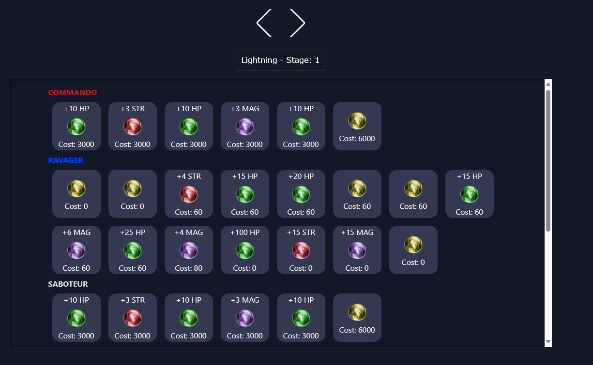

# Description:
A tool to read Final Fantasy 13 Crystal files.
It was my attempt to learn rust and trying to make a webserver for the first time.


# Installation
## Manually
```bash
#Building and running it.
cargo b && cargo r
```

## Released executable
Just unzip it and execute.
The template folder must be in same directory as the executable for html files.

# What does this project?
1. Reading a crystal_*.wdb file.
2. Converting the binary structure in rust structure.
3. Displaying the structure with htmx templating

## FF13 specifics for the convert.
### wdb Node Structure
```
// WDB
//     • int: CP cost
//     • int: String offset - Ability Id
//     • short: Node value
//     • byte: node type
//         ◦ 1 = HP
//         ◦ 2 = Str
//         ◦ 3 = Mag
//         ◦ 4 = Accessory
//         ◦ 5 = ATB
//         ◦ 6 = Ability
//         ◦ 7 = Role
//     • byte / 16: Stage
//     • byte % 16: Role
// Example: 00 00 2E E0, 00 00 01 D9, 00 C3, 01, (91)->0101 1011
// Thanks to Discord .peklo at Fabula Nova Crystallis Discord Server
```


